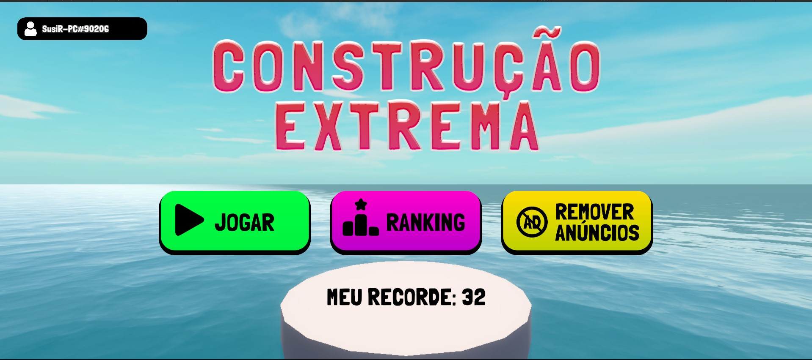
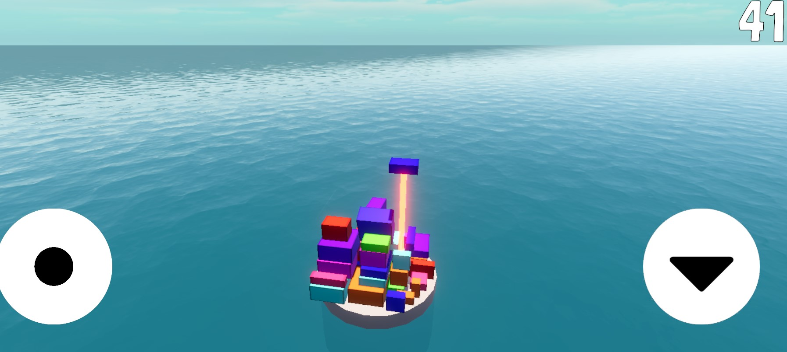
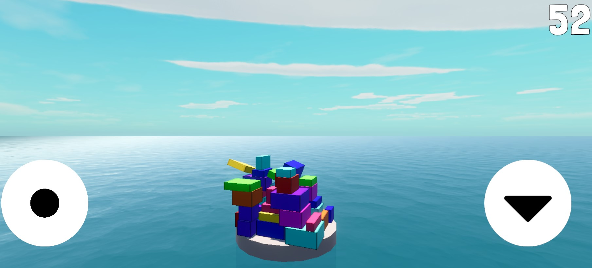
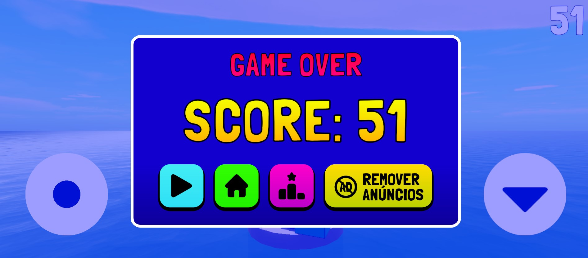
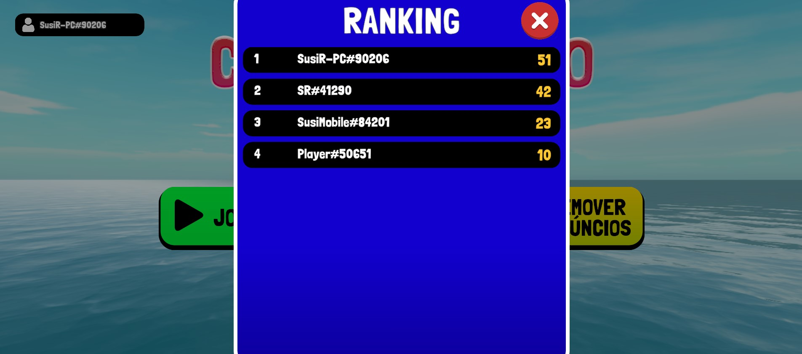

# 🎮 Construção Extrema

Um jogo mobile desenvolvido na **Unity** utilizando **C#**, onde o objetivo é empilhar blocos para construir a torre mais alta possível sem deixar as peças caírem na água.

---

## 🎥 Demonstração

▶️ Assista à demonstração do projeto:
https://youtu.be/B7aNrHSAJr8

---

## 📖 Sobre o projeto

Construção Extrema foi desenvolvido como parte dos meus estudos em desenvolvimento de jogos com Unity.

Durante o desenvolvimento, além da mecânica principal do jogo, foram implementados diversos recursos encontrados em jogos mobile comerciais, proporcionando experiência prática com integração de serviços da Unity, organização de código e desenvolvimento de funcionalidades para dispositivos móveis.

---

## 🚀 Funcionalidades

- Gameplay em terceira pessoa
- Controles adaptados para dispositivos móveis
- Sistema de pontuação
- Ranking online
- Login anônimo do jogador
- Salvamento automático do recorde na nuvem
- Carregamento assíncrono de cenas
- Anúncios intersticiais
- Compra para remoção permanente de anúncios
- Interface adaptada para dispositivos móveis

---

## 🛠 Tecnologias utilizadas

- Unity
- C#
- Unity Gaming Services
- Unity Authentication
- Unity Leaderboards
- Unity Cloud Save
- Unity In-App Purchasing (IAP)
- LevelPlay Ads
- Git
- GitHub

---

## 📸 Capturas de tela

### Menu Inicial

### Gameplay

### Gameplay Avançado

### Tela de Pontuação

### Ranking Online

---

## 📚 Principais aprendizados

Durante o desenvolvimento deste projeto aprofundei conhecimentos em:

- Programação em C#
- Desenvolvimento de jogos com Unity
- Organização de código
- Eventos
- Integração com serviços online da Unity
- Persistência de dados
- Sistema de anúncios
- Compras dentro do aplicativo (IAP)
- Controle de versão com Git e GitHub

---

## 💡 Desafios encontrados

Durante o desenvolvimento deste projeto foram implementadas e aperfeiçoadas diversas funcionalidades, como:

- Integração com Unity Gaming Services
- Autenticação anônima do jogador
- Ranking online
- Sincronização de recordes na nuvem
- Sistema de anúncios intersticiais
- Compras dentro do aplicativo (IAP)
- Adaptação da interface para dispositivos móveis
  
---

## 🔮 Melhorias futuras

- Novos cenários
- Novos tipos de blocos
- Sistema de conquistas
- Efeitos visuais e sonoros adicionais
- Novos modos de jogo

---

## 👩‍💻 Desenvolvido por

Susi da Rosa

Projeto desenvolvido para estudos de Unity, C#, desenvolvimento mobile e composição de portfólio.

